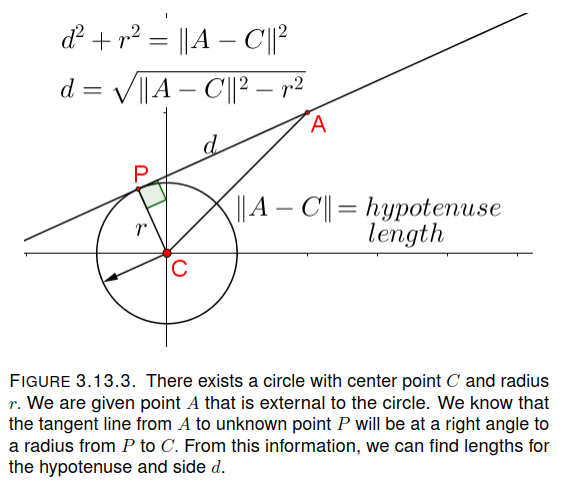
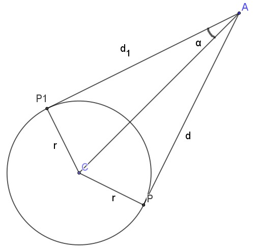

<h2>Tangents to a circle from an external point</h2>
We will write a javascript function that can return the tangent points to a circle from an external point. As input, we will use the circle Center, $C=[x,y],$ the external point, $A=[x,y]$ and the circle radius, $r.$



For output, we will want both tangent points and their associated direction vectors returned. The method we will follow:
1) Find the side lengths,d, and |A-C| of the triangle shown in the figure. Included in the code segment are two auxilary functions. One is used here and one is used later.

```
 function circleTangents(C,A,r){
    //construct vect u = C-A
    let u = [C[0]-A[0], C[1]-A[1]];
    let hyp = absoluteValue(u); //length of the hypotenuse.
}

function absoluteValue(vect){
    return Math.sqrt(vect[0]*vect[0]+vect[1]*vect[1]);
  }

function unitVector(vect){
  return [vect[0]/absoluteValue(vect), vect[1]/absoluteValue(vect)]
}
```
2) And compute length d.
   
```
let d = Math.sqrt(hyp*hyp-r*r);
```
3) Angle $\alpha$ is the angle at $A$, $\angle{PAC}.$  It can be found from the tangent definition: 
 $$\alpha = tan^{-1}(\frac r d)$$

 ```
 let alpha = Math.atan(r/d);
 ```
 

 4) Now build a new basis set.  The x axis we will call $e_1.$  It will be the hypotenuse line in the picture, with point $A$ at (0,0).  The other basis will be a right angle vector called $e_2$ and we get it by exchanging the coordinates of $e_1$ and negating an element.  
```
let e1 = u;
let e2 = [-u[1],u[0]];
let e3 = [u[1],-u[0]]; //switch up and down
```

5) Using these basis vectors, we can build vectors to our tangent points.
$$\mathbf{v} = cos(\alpha)\cdot \mathbf{e_1} + sin(\alpha)\cdot \mathbf{e_2}$$
$$\mathbf{v_1} = cos(\alpha)\cdot \mathbf{e_1} + sin(\alpha)\cdot \mathbf{e_3}$$
and then the tangent points themselves.
$$P = A + d\cdot\bm{v}$$
$$P_1 = A + d\cdot\bm{v_1}$$

```
let v = [Math.cos(alpha)*e1[0]+Math.sin(alpha)*e2[0], Math.cos(alpha)*e1[1]+Math.sin(alpha)*e2[1]];
let v1 = [Math.cos(alpha)*e1[0]+Math.sin(alpha)*e3[0], Math.cos(alpha)*e1[1]+Math.sin(alpha)*e3[1]];
let P = [A[0]+d*v[0], A[1]+d*v[1]];
let P1 = [A[0]+d*v1[0], A[1]+d*v1[1]];

return(P, v, P1, v1)
```


